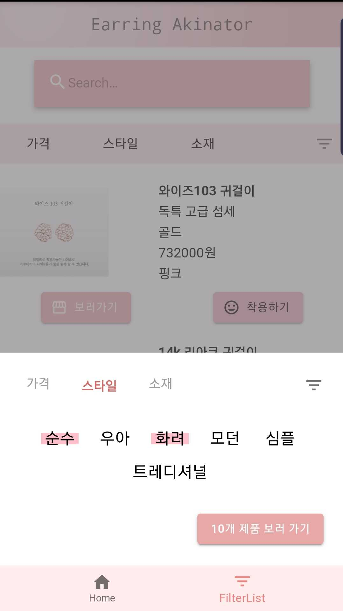

# Accessory Akinator




Accessory Akinator는 귀걸이 AR 가상착용 플랫폼입니다.

## Installation

### Client

**Use node v10,0^**

```
git clone https://github.com/Dailyscat/AccessoryAkinator.git
cd accessoryakinator
npm install
npm start
```

## Features

- jeelizFaceFilter를 활용한 귀걸이 AR 가상 착용
- 원하는 귀걸이 상품 페이지로 바로 이동
- 슬라이더를 활용하여 원하는 귀걸이 가격대 필터링 조건에 추가 가능
- 다중 태그 선택으로 소재와 스타일 필터링 조건에 추가 가능
- 필터링 조건에 따라 실시간으로 쿼리 결과에 따른 해당 상품 품목 수 확인 가능
- AppSync Delta Sync를 활용하여 클라이언트가 Offline에서 Online으로 전환되는 경우 업데이트 된 귀걸이 목록 Data를 업데이트하여 Apollo Cache에 저장

## Client-Side

- ES2015+
- React, Create-React-App
- React-apollo(Apollo Client)
- GraphQL
- Material-UI, Sass

## Server-Side

- AWS AppSync, S3, DynamoDB, Lambda, CloudFront

## Continuous Integration

- 소스관리/빌드/배포를 위하여 S3 sync 명령어를 통한 객체 동기화

## Deployment

- AWS CloudFront, S3

## Project Control

- Git 기반 개발 진행
- Trello를 이용한 Task Management
- Lucid chart를 이용한 AWS Backend Architecture, Database Schema Modeling Sketch

## Error Handling

[cra에서 낮은 react-scripts 버전으로 인해 scss 사용할 수 없던 오류](https://github.com/Dailyscat/Issue-Archive/blob/master/1910%20cra%EC%97%90%EC%84%9C%20%EB%82%AE%EC%9D%80%20react-scripts%20%EB%B2%84%EC%A0%84%EC%9C%BC%EB%A1%9C%20%EC%9D%B8%ED%95%B4%20scss%20%EC%82%AC%EC%9A%A9%ED%95%A0%20%EC%88%98%20%EC%97%86%EB%8D%98%20%EC%98%A4%EB%A5%98.md)

[react를 s3에서 정적 사이트 배포 시 cloud front를 사용하여 https를 적용할 때의 access denied 오류 해결](https://github.com/Dailyscat/Issue-Archive/blob/master/1910%20react%EB%A5%BC%20s3%EC%97%90%EC%84%9C%20%EC%A0%95%EC%A0%81%20%EC%82%AC%EC%9D%B4%ED%8A%B8%20%EB%B0%B0%ED%8F%AC%20%EC%8B%9C%20cloud%20front%EB%A5%BC%20%EC%82%AC%EC%9A%A9%ED%95%98%EC%97%AC%20https%EB%A5%BC%20%EC%A0%81%EC%9A%A9%ED%95%A0%20%EB%95%8C%EC%9D%98%20access%20denied%20%EC%98%A4%EB%A5%98%20%ED%95%B4%EA%B2%B0.md)

[react에서 appsync sdk 호환에러, npm 특정 버전대 설치](https://github.com/Dailyscat/Issue-Archive/blob/master/1910%20react%EC%97%90%EC%84%9C%20appsync%20sdk%20%ED%98%B8%ED%99%98%EC%97%90%EB%9F%AC%2C%20npm%20%ED%8A%B9%EC%A0%95%20%EB%B2%84%EC%A0%84%EB%8C%80%20%EC%84%A4%EC%B9%98.md)

[CRA에서 build 후 상대경로 적용](https://github.com/Dailyscat/Issue-Archive/blob/master/1911%20CRA%EC%97%90%EC%84%9C%20build%20%ED%9B%84%20%EC%83%81%EB%8C%80%EA%B2%BD%EB%A1%9C%20%EC%A0%81%EC%9A%A9.md)

[cloudfront에 캐싱되어 있어서 s3의 호스팅한 객체를 업데이트하고 도메인에 접속해도 캐싱된 자원이 응답되는 경우](https://github.com/Dailyscat/Issue-Archive/blob/master/1911%20cloudfront%EC%97%90%20%EC%BA%90%EC%8B%B1%EB%90%98%EC%96%B4%20%EC%9E%88%EC%96%B4%EC%84%9C%20s3%EC%9D%98%20%ED%98%B8%EC%8A%A4%ED%8C%85%ED%95%9C%20%EA%B0%9D%EC%B2%B4%EB%A5%BC%20%EC%97%85%EB%8D%B0%EC%9D%B4%ED%8A%B8%ED%95%98%EA%B3%A0%20%EB%8F%84%EB%A9%94%EC%9D%B8%EC%97%90%20%EC%A0%91%EC%86%8D%ED%95%B4%EB%8F%84%20%EC%BA%90%EC%8B%B1%EB%90%9C%20%EC%9E%90%EC%9B%90%EC%9D%B4%20%EC%9D%91%EB%8B%B5%EB%90%98%EB%8A%94%20%EA%B2%BD%EC%9A%B0.md)

[s3 호스팅을 사용할 때 react-router가 제대로 작동되지 않는 오류](https://github.com/Dailyscat/Issue-Archive/blob/master/1911%20s3%20%ED%98%B8%EC%8A%A4%ED%8C%85%EC%9D%84%20%EC%82%AC%EC%9A%A9%ED%95%A0%20%EB%95%8C%20react-router%EA%B0%80%20%EC%A0%9C%EB%8C%80%EB%A1%9C%20%EC%9E%91%EB%8F%99%EB%90%98%EC%A7%80%20%EC%95%8A%EB%8A%94%20%EC%98%A4%EB%A5%98.md)

[로컬 path의 이미지를 canvas로 그려내지 못하는 이슈](https://github.com/Dailyscat/Issue-Archive/blob/master/1911%20%EB%A1%9C%EC%BB%AC%20path%EC%9D%98%20%EC%9D%B4%EB%AF%B8%EC%A7%80%EB%A5%BC%20canvas%EB%A1%9C%20%EA%B7%B8%EB%A0%A4%EB%82%B4%EC%A7%80%20%EB%AA%BB%ED%95%98%EB%8A%94%20%EC%9D%B4%EC%8A%88.md)

## Things to do

### 1. FaceFilter API, 얼굴을 돌렸을 때 귀걸이가 귀로 닿는 구도의 불안정성

귀 자체를 인식하는 NNC 파일이 없기 때문에 NNC 파일의 확립이 우선되야 하기 때문에 이후로 설정했다. 대체제로 얼굴을 돌렸을 때 귀걸이가 귀로 닿는 구도 자체가 필요한데 Three.js API를 활용하여 이를 얼굴이라고 인식되는 면적에 상관 없이 유사하게 적용되도록 설정

### 2. 귀걸이 품목 등록

위의 구도가 완료 되면 판매자가 직접 등록하는 폼을 구축하고 관리할 수 있도록 구성한다.

### 3. Etc

- Component Unit Test
- GraphQL API Unit Test
- Integration Test
- Code Refactoring
